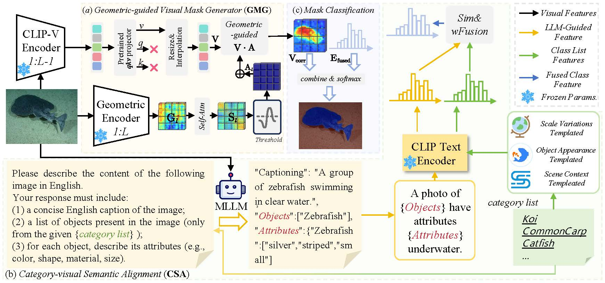

<div align="center">

<h1>Exploring the Underwater World Segmentation without Extra Training</h1>




</div>

## Abstract
> Accurate segmentation of marine organisms is vital for biodiversity monitoring and ecological assessment, yet existing datasets and models remain largely limited to terrestrial scenes. To bridge this gap, we introduce **AquaOV255**, the first large-scale and fine-grained underwater segmentation dataset containing 255 categories and over 20K images, covering diverse categories for open-vocabulary(OV) evaluation. Furthermore, we establish the first underwater OV segmentation benchmark, **UOVSBench**, by integrating AquaOV255 with five additional underwater datasets to enable comprehensive evaluation. Alongside, we present **Earth2Ocean**, a training-free OV segmentation framework that transfers terrestrial vision–language models (VLMs) to underwater domains without any additional underwater training. Earth2Ocean consists of two core components: a Geometric-guided Visual Mask Generator (**GMG**) that refines visual features via self-similarity geometric priors for local structure perception, and a Category-visual Semantic Alignment (**CSA**) module that enhances text embeddings through multimodal large language model reasoning and scene-aware template construction. Extensive experiments on the UOVSBench benchmark demonstrate that Earth2Ocean achieves over significant performance improvement on average while maintaining efficient inference. The clear code is provided in the appendix.*

## Dependencies and Installation


```
# create new anaconda env
conda create -n Earth2Ocean python=3.10
conda activate Earth2Ocean

# install torch and dependencies
pip install -r requirements.txt
```

## Datasets
We include the following dataset configurations in this repo: 
```
AquaOV255, dutuseg, mas3k, SUIM, USIS10K, usis16k.
```


## Model evaluation
Please modify some settings in `configs/base_config.py` before running the evaluation.

For **DepthAnything Model** and **Open-CLIP Model** please download from their official website and put them in `./pretrained_ckpt/`.

Evaluation on all datasets:
```
sh run.sh
```

The results will be saved in `./work_logs/`.